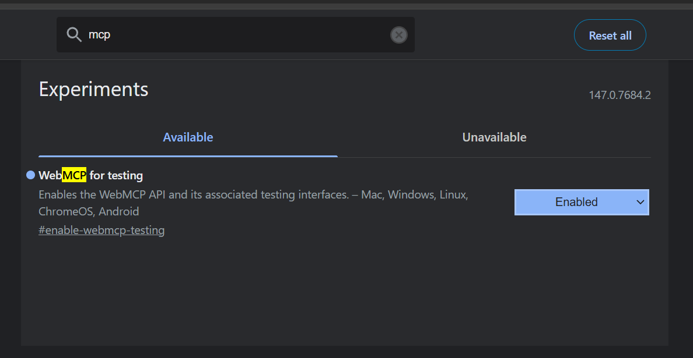
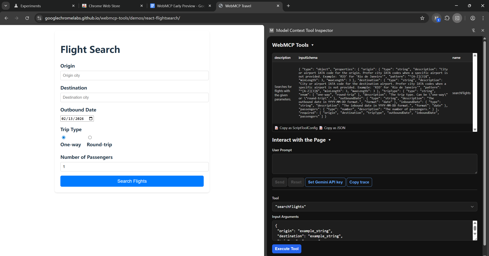

# 什么是 WebMCP 以及它能做什么？

参考官方文档：[WebMCP Explainer](https://docs.google.com/document/d/1rtU1fRPS0bMqd9abMG_hc6K9OAI6soUy3Kh00toAgyk/edit?tab=t.0)

以下是 WebMCP 应用于网站的一些示例：

- 某航空公司的网站暴露了一个 `book_flight` 工具。AI Agent 可以直接通过该工具提交结构化的乘客数据，而不必去猜测该如何在航空公司那个为人类用户设计的日历 UI 上进行输入。
- 复杂的医疗或法律门户网站将表单标注为 `submit_application` 工具。Agent 可以正确且即时地将数据映射到对应字段，而不会把数据重复填入错误的字段。例如，可以明确指示某个字段需要填写完整的法定姓名，还是分开的姓和名字段。
- 开发者设置页面暴露了一个 `run_diagnostics` 工具，这样 Agent 就能直接触发诊断修复操作，而这些操作原本隐藏在层层嵌套的菜单之后。

简单来说，WebMCP 的核心思路就是：让网站主动把自己的能力以"工具"的形式暴露给 AI Agent，这样 Agent 就不用像人一样去"看"页面、"猜"交互方式，而是直接通过结构化的接口完成操作，既准确又高效。

---

# 怎么才能用？

## 浏览器版本要求

需要 Chrome **Version 146.0.7672.0** 或更高版本。

## 下载地址

直接上金丝雀版：<https://www.google.com/intl/en/chrome/canary/>

## 开启 Feature Flag

参考文档：[Chrome Flags 说明](https://developer.chrome.com/docs/web-platform/chrome-flags?hl=zh-cn)

步骤：

1. 地址栏输入 `chrome://flags/`
2. 搜索 `webmcp`
3. 将对应开关设为 **Enabled**



## 下载对应的插件

Model Context Tool Inspector 插件，在刚安装好的金丝雀里安装：

<https://chromewebstore.google.com/detail/model-context-tool-inspec/gbpdfapgefenggkahomfgkhfehlcenpd>

## 访问对应的 Live Demo

文档中列出了多个 Demo，入口在：

<https://docs.google.com/document/d/1rtU1fRPS0bMqd9abMG_hc6K9OAI6soUy3Kh00toAgyk/edit?tab=t.0#heading=h.qq06bobgml10>

比如飞机预定 Demo：<https://googlechromelabs.github.io/webmcp-tools/demos/react-flightsearch/>

点击插件图标，侧边栏就能看到 Inspector 了。然后你应该就能看到：



整过 MCP 的人，应该都能看懂是啥意思。

---

# 发生了啥？

对于程序员来说，最好的解释就是不要解释，直接甩源代码，对吧？

源代码仓库：<https://github.com/GoogleChromeLabs/webmcp-tools/tree/main/demos/react-flightsearch>

## 🤖 Agent / WebMCP 集成

本应用已做好与 AI Agent 协同工作的适配（例如通过浏览器扩展或专用浏览器）。它会检测 `navigator.modelContext` 是否存在，并注册以下工具：

- `searchFlights` — 使用结构化参数（出发地、目的地、日期等）发起航班搜索。
- `listFlights` — 获取当前页面展示的航班列表（以编程方式访问数据）。
- `setFilters` — 对搜索结果应用复杂筛选条件（价格区间、指定航空公司、时间窗口等）。
- `resetFilters` — 清除所有已激活的筛选条件。

## 工作原理

应用为每个工具定义了输入/输出的 schema，并通过 `modelContext.registerTool()` 进行注册。当 Agent 调用某个工具时，应用会执行对应的函数（例如派发自定义事件来更新 React 状态），从而在 AI 模型与 React UI 之间架起桥梁。

具体实现详见 [`src/webmcp.ts`](https://github.com/GoogleChromeLabs/webmcp-tools/blob/main/demos/react-flightsearch/src/webmcp.ts)。

简单的说就是在 `navigator.modelContext` 下注册点东西，加点料。

## 工具一览

| 工具名 | 类型 | 说明 |
|---|---|---|
| `searchFlights` | 写操作 | 发起航班搜索，接收出发地、目的地、日期、乘客数等结构化参数，触发 UI 更新展示搜索结果 |
| `listFlights` | 只读 | 返回当前所有可用航班数据，Agent 可直接拿到结构化的航班列表而无需解析页面 |
| `setFilters` | 写操作 | 对航班结果应用筛选条件（经停次数、航司、价格区间、起降时间窗口等），驱动 UI 过滤展示 |
| `resetFilters` | 写操作 | 清除所有已激活的筛选条件，恢复默认状态 |

核心机制是：写操作通过 `dispatchAndWait` 派发自定义事件给 React 组件，等待 UI 更新完成后才返回结果，实现了 **Agent 调用 → 事件派发 → React 状态更新 → 回调确认** 的完整闭环。`listFlights` 则是纯数据读取，直接返回内存中的航班数组。

---

# 核心前端原理梳理

把整个调用链路从头到尾捋一遍。

## 1. `searchFlights` 被 Agent 调用后

```text
Agent 调用 searchFlights({ origin: "PEK", destination: "SHA", ... })
  → 校验参数格式（IATA 三字码）
  → dispatchAndWait("searchFlights", params)
    → 生成一个随机 requestId
    → 向 window 派发 CustomEvent("searchFlights")，detail 里带着搜索参数和 requestId
    → 开始等待（最多 5 秒）
  → React 组件通过 window.addEventListener("searchFlights", handler) 监听到这个事件
    → 从 event.detail 中取出 origin、destination、date 等参数
    → 调用 setState 更新搜索条件，触发 React 重新渲染
    → 页面 UI 刷新，展示新的搜索表单状态 / 跳转到结果页
    → 完成后派发 CustomEvent("tool-completion-{requestId}")
  → dispatchAndWait 收到完成事件，resolve 返回 "A new flight search was started."
  → Agent 拿到这个字符串，知道搜索已成功发起
```

简单说：Agent 告诉页面"我要搜从北京到上海的航班"，页面就像用户手动填表点搜索一样更新了。

## 2. `listFlights` 被 Agent 调用后

```text
Agent 调用 listFlights()
  → 直接 return flights（从 data/flights.ts 导入的静态数组）
  → Agent 拿到一个 Flight[] 数组，包含所有航班的结构化数据
```

这个最简单，没有事件派发，没有 UI 变化。纯粹是让 Agent 拿到数据，相当于给了 Agent 一个"读数据库"的能力。Agent 拿到数据后可以自己做分析、比较、推荐。

## 3. `setFilters` 被 Agent 调用后

```text
Agent 调用 setFilters({ airlines: ["CA"], maxPrice: 2000, stops: [0] })
  → dispatchAndWait("setFilters", filters)
    → 生成 requestId，派发 CustomEvent("setFilters")
    → 等待完成信号
  → React 组件监听到 "setFilters" 事件
    → 从 detail 中取出筛选条件
    → setState 更新 filter 状态
    → React 重新渲染航班列表，只显示符合条件的航班
      （比如：只显示国航直飞、2000 元以下的航班）
    → 派发 tool-completion 事件
  → 返回 "Filters successfully updated."
```

效果就是：页面上的航班列表瞬间被过滤了，就像用户手动拖了价格滑块、勾了"直飞"复选框一样。

## 4. `resetFilters` 被 Agent 调用后

```text
Agent 调用 resetFilters()
  → dispatchAndWait("resetFilters", {})
    → 派发 CustomEvent("resetFilters")，detail 只有 requestId
  → React 组件监听到事件
    → 把所有 filter 状态重置为初始值
    → 重新渲染，显示全部航班
    → 派发 tool-completion 事件
  → 返回 "Filters successfully updated."
```

相当于用户点了"清除所有筛选"按钮。

---

# 整体模式总结

核心就是一个桥接模式：

```text
AI Agent
  ↓ 调用工具函数
webmcp.ts（桥接层）
  ↓ 派发 CustomEvent
React 组件（UI 层）
  ↓ 监听事件 → 更新 state → 重新渲染
浏览器页面（用户看到的）
  ↓ 完成后派发 completion 事件
webmcp.ts
  ↓ resolve Promise
AI Agent 拿到结果
```

React 那边你可以简单理解为：`setState` 就是"改数据"，数据一改，React 自动把页面重新画一遍。所以 Agent 通过事件改了数据，页面就自动跟着变了，用户能实时看到 Agent 的操作结果。


# 价值？

感觉不用啰嗦了，就是再也不需要让brower-use那类工具去猜网页该怎么用了，直接把前端的调用链路拆出来，给AI说的明明白白的，你调用就好了，也别瞎折腾了

这个东西其实就是一套约定，也就是说其实前端编程的时候，只需要把需要暴露的核心的API，给AI说明白了，然后用一个SKILL，把vue、react等等前端组件，包括裸js的写作规范写成一个SKILL，给AI说明怎么实现这套约定/协议，然后放在js里，注册好上下文和工具。

接着AI过来，只需要访问对应的注册工具后，就可以开始调用了

谷歌当下的玩法是，使用了一个谷歌插件，其实未来肯定会直接集成在游览器里面的...

# 当下？脑洞

也就是说，其实我自己现在就可以写一整套的js+SKILL规范，然后自己写一个插件，用非gemeni的方式，也可以实现这一套东西

嗯，前日写的AI收藏夹插件其实就已经是一个非常好的样本了

甚至！甚至可以用插件将，不是你自己的网站，也注入这一套东西，然后给AI sidecar去使用，说白了mcp就是SKILL的前身嘛

不过mcp确实介入的更深

# 类比？

其实就是类比与当年的iOS的快捷方式，相比也是类似的东西，可惜啊，快捷方式毁了，嗯~~~

# 评价

非常实用的东西，尤其对于复杂交互的网站：如电商、旅行预定这类，确实非常实用，把自己的接口直接暴露给AI了，当然商业逻辑，那是另外一个话题
